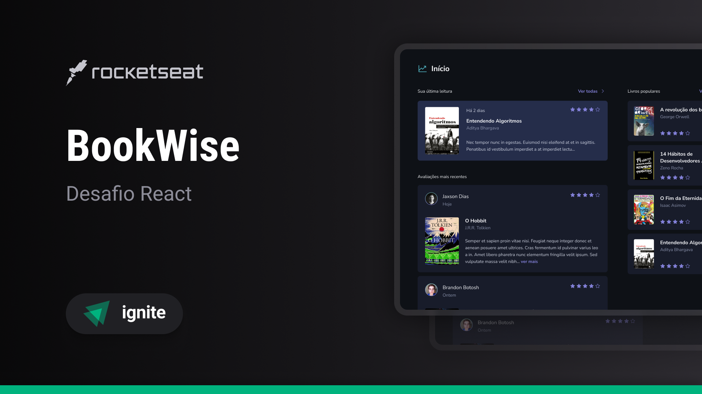

# Book Wise

<p>
    
</p>

## :computer: Projeto

Este projeto foi construído com Next.js e faz o gerenciamento de leituras. A construção do frontend foi feita toda em cima do Next 13, e além disso pude desenvolver o backend com prisma, banco de dados mysql com docker e etc.

## :rocket: Tecnologias

- [React](https://reactjs.org)
- [Next.js](https://nextjs.org)
- [Radix ui](radix-ui.com)
- [Prisma](https://www.prisma.io)
- [Zod](https://zod.dev)
- [React Hook Form](react-hook-form.com)
- [React Query](tanstack.com/query/latest)
- Google APIs
- Google Cloud Platform
- Github APIs

## :thinking: Como rodar o projeto?

Crie um arquivo .env com as seguintes variáveis

```env
NEXT_PUBLIC_APP_URL=http://localhost:3000
DATABASE_URL=""

# Google oAuth

GOOGLE_CLIENT_ID=
GOOGLE_CLIENT_SECRET=

# Github oAuth

GITHUB_ID=
GITHUB_SECRET=

# Next Auth

NEXTAUTH_SECRET=
NEXTAUTH_URL=http://localhost:3000
```

1. Para a `DATABASE_URL` eu utilizei como opção o docker, você pode fazer o mesmo

2. Para a `GOOGLE_CLIENT_ID` e `GOOGLE_CLIENT_SECRET` você deve configurar um projeto no [Console Google Cloud](https://console.cloud.google.com/)

3. Segue o mesmo raciocínio para `GITHUB_ID` e `GITHUB_SECRET`, configurando nas [developers settings](https://github.com/settings/developers) do Github

4. Para a `NEXTAUTH_SECRET`, gere um hash qualquer em um site e coloque nele

5. Rodar o comando `npm run dev`
